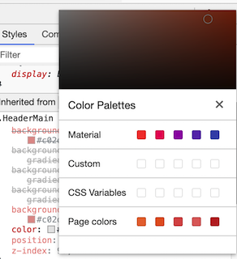

# 简单复习各个面板

### Elements

浏览DOM树，浏览样式。

### Console

一个REPL。

小技巧： 在任何非Console面板中，按ESC可以调出一个小的Console窗口，方便开发者Debug。

### Sources
类似一个文本编辑器。右边有一个Debugger，我们可以用它来Debug，可以做比console.log更复杂的事。

### Network
显示请求瀑布流。

### Performance
我们可以Record一些操作，然后在这个面板中查看一些信息。

### Memory
查看页面的内存占用具体情况，可以定位内存泄漏原因。

### Application
显示各种浏览器储存情况，比如local storage， Session Storage，cookie。 查看网站储存了用户的哪些信息。

### Security
查看安全证书，连接是否安全。

### Audits
网站性能的总结，整合了google自家的Lighthouse功能。基于平均水平的网络速度和设备性能作出的评估。

# 深入各个面板
## 编辑 Editing

### 元素和样式 

我们可以点击Elements面板中的HTML文本，做更改，也可以点击CSS属性，做更改。

在Elements面板，按住option点击展开一个元素节点的箭头会展开当前节点下的所有子节点。

在Elements面板，我们长按一个节点可以移动该节点在DOM树中的位置。

右键一个DOM节点，选择Scroll into view，可以迅速找到页面中节点的位置。

选择一个DOM节点，按“H”隐藏这个节点，调整的是visibility属性。如果visibilty在CSS中被标记了!important则不能被隐藏。按“delete”删除这个节点，ctrl+z撤销删除。

在Style面板中，我们按住Shift点击一个颜色块，我们可以更改颜色的表达格式，在HEX，RGB，HSL间切换。

在Style面板中，我们可以左键点击一个颜色块，调出调色板。这个调色板有一个最大的好处就是里面总是保存了Material Design的配色,方便了开发者选择颜色。



在DOM树中选择一个节点，在右边样式面板中点击:hov，可以选择强制触发各种鼠标事件，方便开发者检查触发事件时的CSS属性。

### 元素节点

有的时候我们会发现一个元素节点有好几个CSS选择器，比如浏览器有默认样式，你自己写了一个样式，你又用了一个CSS库比如Bootstrap加了另一个样式。我们可以点击Computed面板，来检查最后有用的样式是哪些。

在Event Listeners面板中，我们可以观察该节点的所有事件。如果我们点击旁边的JS文件名，会跳转到Source面板展示事件处理函数的实现代码。

当Source面板中的代码格式是被压缩过的时候，我们点击左下角的大括号{}“Pretty Print”按钮，可以美化代码样式。

DOM断点。右键点击一个元素节点，选择Break On。我们有三种Debug的选择，为什么这个节点被删除(node removal)，为什么这个节点的某种属性发生了变化(attribute modification)，或者为什么这个节点的子节点发生了变化(subtree modification)。当代码触发断点的时候，Sources面板会自动打开，展示引发节点变化的具体代码。


### 更改本地文件

在Sources面板中，选择Filesystem面板，我们可以打开本地的workspace。然后我们再前往Elements面板中调试CSS样式，会发现一些CSS文件图标被标上了绿色圆点，这就表示现在我们在Devtool做的调试，本地的文件也会被更改，Sass也有用，但是使用webpack的项目不一定支持这个功能。

但是在Elements面板左边的DOM树中做更改，不会改变本地的HTML文件。因为DOM树只是浏览器根据我们写的HTML生成的，并没有直接更改HTML文件的能力。如果我们想要更改HTML和JS文件，我们可以在Sources面板中做到，就像使用文本编辑器一样。

### 选择元素历史

在Elements面板中左键点击选择一个节点，然后进入Console面板，输入:
```
$0
```
就会返回刚才最近选择的一个节点。以此类推，$1会返回第二近选择的一个节点。

说到$符号，Console里也可以使用类似Jquery的$选择器,输入$,按回车，就会返回Jquery选择器函数。

## 调试 Debug

小技巧：在开发者工具的任意面板按ctrl+shift+P，我们可以打开一个命令行，里面有很多常用Dev Tool操作。方便开发者少用鼠标。而在Sources面板中ctrl+P是打开具体文件。

### 断点

在Sources面板中打开一个JS文件，我们可以在代码中加入
```
debugger;
```
来打断点。我们还可以直接点击代码行数来打断点，行数会变蓝。当代码运行到断点的时候，我们会在调试操作面板中看到“Paused on breakpoint“的提示。**注意断点是在该行代码执行前断而不是之后。**

除了常见的Step over, Step into功能按钮，我们还有一些其他面板。

* Watch 我们可以在Watch中添加任何变量。可以观察该变量在当前断点的作用域中是defined还是undefined。

* Call Stack 顾名思义，观察这个断点发生之前，被调用过的函数。

* Scope 观察当前作用域中我们所有可以调用的变量。如果知道要具体看哪个变量还是用Watch比较方便。

* Breakpoints 告诉我们目前可用的断点。我们可以取消打勾来取消断点。

* XHR/fetch Breakpoint 加入自定义请求断点，在特定URL请求发生的时候打断。然后可以在Call Stack面板中找到涉及到这个请求的代码文件。


### Blackbox功能

当我们使用很多库的时候，比如React，d3.js。如果我们在调试面板中看到了一些文件名属于第三方库，我们可以右键点击然后Blackbox它。意思是我们不需要看到第三方库的代码运行过程。在开发者工具的setting中，我们可以设置永久Blackbox名单。

### 条件性断点

当一个函数被经常调用，但是只在特定情况下出错的时候。我们可以使用条件性断点。比如我们只想要在ajax函数被传入特定参数的时候才打断，而不是所有ajax call都打断让我们看。我们可以右键点击一个行数，选择Conditional Breakpoint然后我们可以输入参数条件。这种断点，行数会变成黄色。


  [1]: /img/bVbtEyt

官方文档
[Chrome Developer Tool](https://developers.google.com/web/tools/chrome-devtools/)
